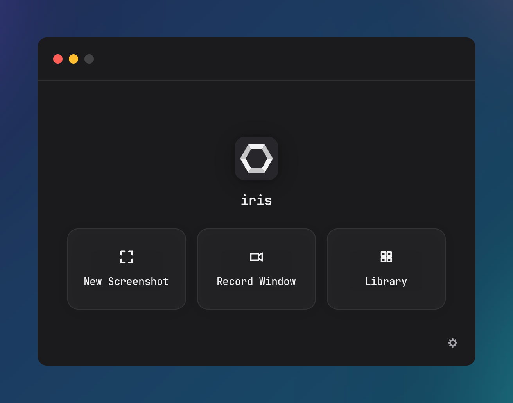

# iris

iris is a screenshot and screen-recording tool for Linux (X11 and Wayland), Windows, and macOS. A background daemon holds the global hotkeys and the tray icon. A capture freezes the screen for region selection, saves a PNG, copies it to the clipboard, and shows a thumbnail toast that opens the annotation editor.


## Features

- [Screen Capture](docs/capture.md): Frozen-frame region selection, window snap, 8x loupe magnifier, pixel color sampler, full-screen, and delayed capture.
- [Toast Notifications](docs/toast.md): Post-capture thumbnail card with file drag-out, action bar, and pinned reference windows.
- [Annotation Editor](docs/editor.md): Vector markup tools including pen, arrows, shapes, text, blur, counter badges, and crop.
- [Screen Recording](docs/recording.md): Window and region video recording via ffmpeg, with floating indicator chip and MP4, GIF, and WebM export.
- [Capture Library](docs/library.md): Thumbnail grid with batch selection, file drag-out, quick copy, and folder reveal.
- [CLI Dispatch](docs/cli.md): Arguments forward to the running daemon over local IPC for window manager and compositor keybindings.
- [Configuration](docs/configuration.md): Plain TOML settings file and graphical configuration editor.
- [Cross-Platform](docs/platforms.md): Native backend integration for X11, Wayland portals, Windows GDI, and macOS CoreGraphics.

## Install

Download installers and binaries from [Releases](https://github.com/santhreal/iris/releases). See the [Installation Guide](docs/install.md) for full instructions and checksums.

- **Windows**: Run `iris-<ver>-windows-x86_64-setup.exe` (per-user installation, autostart registered).
- **macOS**: Drag `iris.app` from `iris-<ver>-macos-universal.dmg` to Applications (status-bar menu item).
- **Linux**: Install `iris-<ver>-linux-x86_64.deb` on Debian/Ubuntu, `iris-<ver>-linux-x86_64.rpm` on Fedora/RHEL, or run `iris-<ver>-linux-x86_64.AppImage`.
- **Source**: `cargo build --release --bin iris`. Build dependencies per platform are in the [Installation Guide](docs/install.md#build-requirements-and-compilation).

Recording requires `ffmpeg`.


## Quick Start

1. Start iris:
   ```sh
   iris
   ```
   The daemon runs in the background with a tray icon. The application menu entry on Linux and the Start menu shortcut on Windows run `iris --home`, which opens the home window. On macOS, opening iris.app while the daemon runs with no iris window open shows the home window.
2. Press `Print` (`F13` on macOS) or run `iris --capture` to open the region capture overlay.
3. Click a window to capture it, or drag a rectangle and press `Enter`.
4. Click the preview toast to open the annotation editor.
5. Press `Ctrl+Shift+R` or run `iris --record-window` to toggle window recording.



## Documentation

The manual starts at [docs/SUMMARY.md](docs/SUMMARY.md).

## License

iris is licensed under either the [MIT License](LICENSE-MIT) or the [Apache License, Version 2.0](LICENSE-APACHE).
