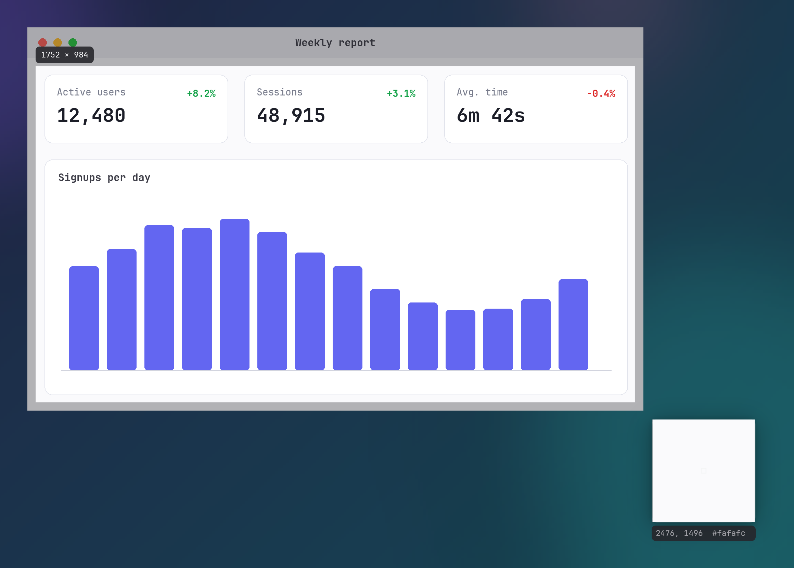

# Screen Capture

iris provides region, fullscreen, active-window, and timed capture modes.



## Capture Modes

### Region Capture

Trigger region capture using any of the following interfaces:
- Keybind: `Print` (configured by `capture_hotkey` in [configuration.md#keyboard](configuration.md#keyboard))
- Command-line interface: `iris --capture` (see [cli.md#command-reference](cli.md#command-reference))
- Home window: **New Screenshot** tile
- System tray menu: **Capture**

The region overlay freezes the screen into an image frame across all monitors and fades in a dimming layer over 180 milliseconds, peaking at 0.32 opacity.

Features in region capture mode:
- **Crosshair coordinate readout**: Displays physical coordinates (`fx, fy`) adjacent to the cursor. The readout shifts position when approaching display boundaries.
- **Window hover snap**: Queries top-level windows in stacking order. Available on X11, Windows, and macOS. Unavailable on Wayland because Wayland compositors do not expose window layouts to client applications (see [platforms.md#platform-capabilities-matrix](platforms.md#platform-capabilities-matrix)). The hovered window rectangle un-dims with a 90-millisecond fade-in, and the previously hovered window fades out over 90 milliseconds. Clicking with less than 4.0 logical pixels of pointer movement selects that window and commits the capture.
- **Drag region selection**: Click and drag to define an area. Selections smaller than 3.0 logical pixels in width or height are cleared on release. Hold `Shift` while dragging to constrain the selection to a square. The selection boundary displays rounded physical dimensions (`width × height`) above the selection, or below if the top coordinate is under 44 logical pixels. An instruction line below the selection displays confirmation and cancellation bindings (`Enter capture   Escape cancel` by default).
- **Loupe magnifier**: Active during drag and resize operations. Magnifies a 19×19 source pixel grid by 8× into a 152×152 logical pixel preview with crosshairs on the center pixel. An info banner below the loupe displays `{fx}, {fy}  #{hex}` with the center pixel physical coordinates and lowercase 6-digit hexadecimal color value. Flips to the opposite side of the cursor near display edges.
- **Color copy**: Press `c` while dragging or resizing to copy the loupe center pixel color (`#rrggbb`) to the system clipboard.
- **Selection repositioning**: Click and drag inside an existing selection boundary (outside resize handles) to translate the selection across the screen, clamped to display boundaries.
- **Selection resizing**: Eight resize handles (10.0 logical pixels square each) are positioned at the four corners (NW, NE, SW, SE) and four edge midpoints (N, S, W, E). Dragging a handle resizes the selection; the loupe tracks the moving edge.
- **Nudge keys**: Press `Left`, `Right`, `Up`, or `Down` arrow keys to translate the selection by 1.0 logical pixel. Hold `Shift` with arrow keys to translate by 10.0 logical pixels. Coordinates clamp to display boundaries.
- **Monitor snap**: Press number keys `1` through `9` to snap the selection to the corresponding monitor index.
- **Double-click commit**: Double-clicking inside the selection commits the capture.
- **Confirmation and Cancel**: Press `Enter` (or the configured `confirm_keybind`) to commit. Press `Escape` (or the configured `cancel_keybind`), or click the right mouse button, to cancel the capture.

### Fullscreen Capture

```sh
iris --capture-fullscreen
```

Grabs the union of all connected monitors into a single image frame without displaying the region overlay.

If `flash_on_capture` is true in [configuration.md#capture](configuration.md#capture) (default: `true`), displays a white flash window spanning the monitor union peaking at 0.38 opacity and easing out over 180 milliseconds. The flash opens after the frame is read, so it does not appear in the image.

### Window Capture

```sh
iris --capture-window
```

Captures the focused window bounding rectangle, including window decorations, directly off the root screen without grabbing the full screen:
- **X11**: Queries `_NET_ACTIVE_WINDOW` and window geometry.
- **Windows**: Calls `GetForegroundWindow` and `GetWindowRect`.
- **macOS**: Reads the frontmost on-screen window from the window list.
- **Wayland**: Unavailable. Returns an error because Wayland compositors do not expose focused window identity or coordinates to client applications.

### Delayed Capture

```sh
iris --delay 5
```

Accepts a non-negative integer representing seconds (`u64`). If omitted or non-numeric, iris ignores the option.

Pauses execution for the specified duration using an asynchronous timer, then triggers fullscreen capture. Does not render an on-screen visual countdown.

## Post-Capture Pipeline

When a capture commits, iris executes the following pipeline in order:
1. **Shutter Sound**: If `sound_on_capture` is true in [configuration.md#capture](configuration.md#capture) (default: `true`), plays audio at the grab moment:
   - **Linux**: Plays `/usr/share/sounds/freedesktop/stereo/camera-shutter.oga` through `pw-play`, falling back to `paplay`, then `canberra-gtk-play -i camera-shutter`.
   - **macOS**: Plays `/System/Library/Components/CoreAudio.component/Contents/SharedSupport/SystemSounds/system/Screen Capture.aif` (fallback `Grab.aif`) through `/usr/bin/afplay`.
   - **Windows**: Synthesizes a shutter click waveform in memory and plays it via `PlaySoundW` on the system-sounds volume channel.
   - Absence of audio utilities or files produces silence without error.
2. **Directory Creation**: Creates `screenshots_dir` (default: `~/Pictures/iris`, see [configuration.md#storage](configuration.md#storage)) if the directory does not exist.
3. **Filename Generation**: Formats the output path under `screenshots_dir` using `screenshot_template` (default: `"{date}_{time}"`). Substitutes `{date}` with `YYYY-MM-DD` and `{time}` with `HH-MM-SS` from a single local clock read. If the file exists, appends `-2.png`, `-3.png`, and ascending numbers.
4. **Pixel Stashing**: Caches decoded RGBA pixels in a process-wide single-slot memory cache so immediate thumbnail generation or annotation avoids re-decoding the saved file.
5. **Disk Save**: Encodes RGBA pixels to PNG format using Fast compression and Adaptive filtering, then writes the file to disk on a background thread.
6. **Clipboard Copy**: If `copy_to_clipboard` is true in [configuration.md#capture](configuration.md#capture) (default: `true`), copies RGBA bitmap data to the system clipboard on a dedicated background thread named `iris-clipboard`.
7. **Library Registration**: Records image dimensions, file path, and creation timestamp into `library.json` and writes a cached thumbnail to disk.
8. **Interactive Toast**: If `show_toast_after_capture` is true in [configuration.md#toast](configuration.md#toast) (default: `true`), opens the toast stage. Region captures animate a flight from selection coordinates to the resting card position; fullscreen and window captures display the toast directly (see [toast.md#toast-notifications](toast.md#toast-notifications)).
