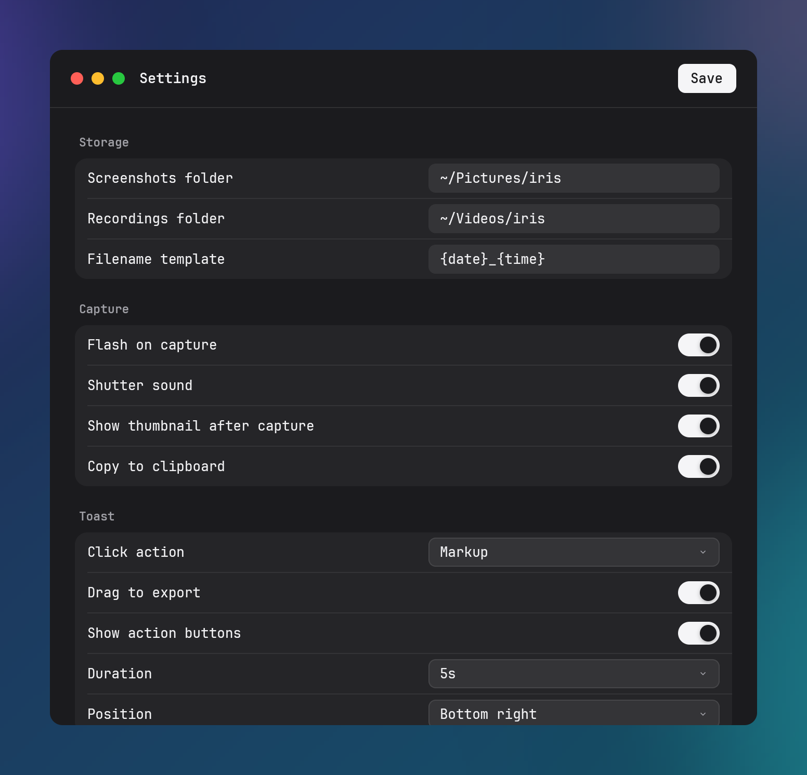

# Configuration

Configuration resides in `config.toml`. When no configuration file exists, iris generates `config.toml` populated with default values.

## File Paths

Configuration file paths resolve through `directories::ProjectDirs::from("dev", "iris", "iris")`:

| Platform | Configuration File Path |
| --- | --- |
| Linux | `$XDG_CONFIG_HOME/iris/config.toml` (defaults to `~/.config/iris/config.toml` when `$XDG_CONFIG_HOME` is unset) |
| Windows | `%APPDATA%\iris\iris\config\config.toml` |
| macOS | `~/Library/Application Support/dev.iris.iris/config.toml` |

### Legacy Migration

When `config.toml` does not exist and `IRIS_HOME` is unset, iris checks for a legacy configuration file from the previous application name (`directories::ProjectDirs::from("dev", "glint", "glint")`):
- Linux: `~/.config/glint/config.toml`
- Windows: `%APPDATA%\glint\glint\config\config.toml`
- macOS: `~/Library/Application Support/dev.glint.glint/config.toml`

If a legacy configuration file exists, iris copies it to the destination `config.toml`. If `config.toml` already exists or if `IRIS_HOME` is defined, migration is bypassed.

### `IRIS_HOME` Directory Override

Setting the environment variable `IRIS_HOME` to a non-empty path overrides directory resolution across all platforms. When `IRIS_HOME` is defined:

| Target | Path | Description |
| --- | --- | --- |
| Config | `$IRIS_HOME/config/config.toml` | Configuration file |
| Data | `$IRIS_HOME/data` | Persistent data directory (stores `library.json`) |
| Cache | `$IRIS_HOME/cache` | Cache directory (stores thumbnails and frozen frames) |
| Log | `$IRIS_HOME/state/iris.log` | Application log file |

When `IRIS_HOME` is unset, default persistent directories resolve as follows:

| Target | Linux | Windows | macOS |
| --- | --- | --- | --- |
| Data | `$XDG_DATA_HOME/dev.iris.app` (`~/.local/share/dev.iris.app`) | `%APPDATA%\dev.iris.app\data` | `~/Library/Application Support/dev.iris.app` |
| Cache | `$XDG_CACHE_HOME/dev.iris.app` (`~/.cache/dev.iris.app`) | `%LOCALAPPDATA%\dev.iris.app\cache` | `~/Library/Caches/dev.iris.app` |
| Log | `$XDG_STATE_HOME/iris/iris.log` (`~/.local/state/iris/iris.log`) | `%APPDATA%\iris\iris.log` | `~/Library/Application Support/iris/iris.log` |

### Tilde Expansion

A leading `~` in `screenshots_dir` and `recordings_dir` expands to the home directory (`directories::UserDirs::new().home_dir()`) on every platform. iris writes a directory under the home directory in `~` form, both when it generates `config.toml` and when the settings window saves, so the file stays valid on a machine with a different home directory. The settings window shows the directories in the same form.

## Default Configuration

```toml
screenshots_dir = "~/Pictures/iris"
recordings_dir = "~/Videos/iris"
screenshot_template = "{date}_{time}"
record_mic_default = false
recording_fps = 30
recording_format = "mp4"
recording_encoder = "auto"
show_toast_after_capture = true
capture_hotkey = "Print"
record_hotkey = "Ctrl+Shift+R"
flash_on_capture = true
sound_on_capture = true
toast_click_action = "markup"
toast_drag_enabled = true
toast_pin_enabled = true
toast_show_actions = true
toast_duration_ms = 5000
toast_position = "bottom-right"
copy_to_clipboard = true
cancel_keybind = "Escape"
confirm_keybind = "Enter"
```

Missing fields in an existing `config.toml` fall back to default values upon loading. If parsing fails due to invalid TOML syntax, iris logs an error, uses default values in memory, and leaves the file unchanged.

## Field Reference

### Storage

- `screenshots_dir` (Path string, default: the platform Pictures directory joined with `iris`, `~/Pictures/iris` on a default install):
  Directory for saved screenshot PNG files.
- `recordings_dir` (Path string, default: the platform Videos directory joined with `iris`, `~/Videos/iris` on a default install):
  Directory for saved video recordings.
- `screenshot_template` (String, default: `"{date}_{time}"`):
  Filename template for saved captures. Accepts `{date}` (`YYYY-MM-DD`) and `{time}` (`HH-MM-SS`). Validation requires `{date}` or `{time}` in the template string.

### Capture

- `flash_on_capture` (Boolean, default: `true`):
  Displays a white flash across every monitor after a fullscreen capture reads the screen (`iris --capture-fullscreen` and `iris --delay`). Region and window captures do not flash.
- `sound_on_capture` (Boolean, default: `true`):
  Emits a shutter audio effect when saving a capture.
- `show_toast_after_capture` (Boolean, default: `true`):
  Displays an interactive preview [toast notification](toast.md#toast-notifications) after committing a capture.
- `copy_to_clipboard` (Boolean, default: `true`):
  Copies captured RGBA pixels to the system clipboard upon finalize.

### Toast

- `toast_click_action` (String enum, default: `"markup"`):
  Action executed upon clicking the toast thumbnail.
  Allowed values:
  - `"markup"`: Open markup [annotation editor](editor.md#annotation-editor) window.
  - `"copy"`: Copy image pixels to clipboard.
  - `"open-folder"`: Reveal saved file in system file manager.
  - `"none"`: Suppress click actions (display-only).
- `toast_drag_enabled` (Boolean, default: `true`):
  Enables dragging the thumbnail directly into external file managers, browsers, or applications.
- `toast_pin_enabled` (Boolean, default: `true`):
  Controls display of the pin button on the toast action bar (see [Pinned Windows](toast.md#pinned-windows)). Configured in `config.toml`; not exposed in the settings window.
- `toast_show_actions` (Boolean, default: `true`):
  Displays action buttons under the toast thumbnail.
- `toast_duration_ms` (Integer, default: `5000`):
  Auto-dismiss countdown interval in milliseconds.
- `toast_position` (String enum, default: `"bottom-right"`):
  Screen corner where the toast anchors.
  Allowed values:
  - `"bottom-right"`
  - `"bottom-left"`
  - `"top-right"`
  - `"top-left"`

### Recording

- `recording_fps` (Integer, default: `30`):
  Target capture frame rate in frames per second. Validation restricts values to the range 1 through 120.
- `recording_format` (String enum, default: `"mp4"`):
  Output file container and codec for [screen recordings](recording.md#screen-recording).
  Allowed values:
  - `"mp4"`: H.264 video with AAC audio.
  - `"gif"`: Animated GIF image without audio track.
  - `"webm"`: VP9 video in WebM container. Linux records audio as Opus; Windows and macOS record without an audio track.
- `recording_encoder` (String enum, default: `"auto"`):
  Video encoder for MP4 recordings.
  Allowed values:
  - `"auto"`: Probes `ffmpeg` for `h264_nvenc` availability, using hardware encoding when present and falling back to `libx264`.
  - `"libx264"`: Software x264 CPU encoder.
  - `"nvenc"`: NVIDIA NVENC hardware-accelerated encoder (`h264_nvenc`).
- `record_mic_default` (Boolean, default: `false`):
  Enables microphone audio capture by default for new screen recordings.

### Keyboard

- `capture_hotkey` (String, default: `"Print"`):
  Global hotkey chord to open the region capture overlay. macOS keyboards have no Print Screen key; on macOS, `Print` binds `F13`.
- `record_hotkey` (String, default: `"Ctrl+Shift+R"`):
  Global hotkey chord to toggle window or screen recording.
- `cancel_keybind` (String, default: `"Escape"`):
  Key to cancel overlay selection, recording pick mode, or editor changes.
- `confirm_keybind` (String, default: `"Enter"`):
  Key to confirm selection in the overlay or apply changes in the editor.

## Settings Window



Open the settings window by executing `iris --settings`, selecting **Settings** from the system tray menu, or clicking the gear button in the bottom-right corner of the home window.

The settings window contains six sections:
1. **Storage**: Configure screenshots directory, recordings directory, and filename template.
2. **Capture**: Toggle screen flash, shutter sound, post-capture toast display, and automatic clipboard copy.
3. **Toast**: Select click action, drag-to-export toggle, action buttons visibility, auto-dismiss duration (2s, 3s, 5s, 8s, 10s), and screen corner position.
4. **Recording**: Configure frame rate, container format, MP4 encoder, and default microphone toggle.
5. **Keyboard**: Record hotkeys for region capture, recording toggle, cancel action, and confirm action.
6. **Updates**: Displays current version and provides a **Check for updates** button.

Drag the toolbar to move the window. Drag an edge or corner to resize it; the window stops at 640×600.

### Save Behavior

Pressing `Enter` in a text field commits the edit. A directory must be an absolute path or start with `~`, the filename template must include `{date}` or `{time}`, and frame rate must parse to an integer from 1 to 120. A rejected edit stays open with the typed text, and the error shows in the status line.

Clicking **Save**:
1. Commits an open text edit under the same rules. A rejected edit stops the save.
2. Serializes the updated configuration and writes to `config.toml` via `Config::store`.
3. Updates the in-memory configuration cache with the directories expanded.
4. Re-registers global hotkeys in the running daemon.

Clicking **Reset to defaults** restores default configuration values in the form. Restored values do not overwrite `config.toml` until **Save** is clicked.
