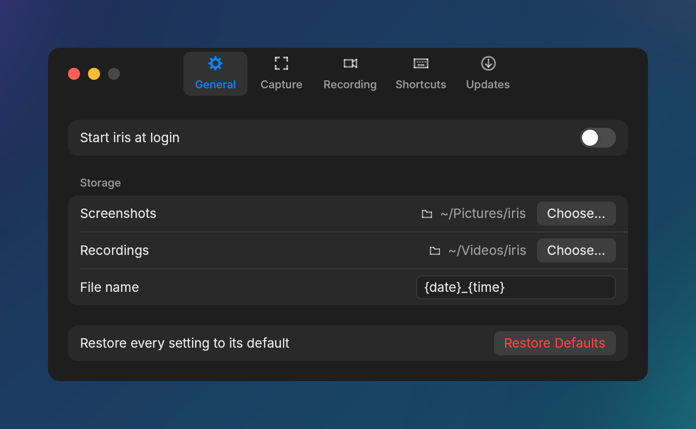

# Configuration

Configuration resides in `config.toml`. When no configuration file exists, iris generates `config.toml` populated with default values.

## File Paths

Configuration file paths resolve through `directories::ProjectDirs::from("dev", "iris", "iris")`:

| Platform | Configuration File Path |
| --- | --- |
| Linux | `$XDG_CONFIG_HOME/iris/config.toml` (defaults to `~/.config/iris/config.toml` when `$XDG_CONFIG_HOME` is unset) |
| Windows | `%APPDATA%\iris\iris\config\config.toml` |
| macOS | `~/Library/Application Support/dev.iris.iris/config.toml` |

### Legacy Migration

When `config.toml` does not exist and `IRIS_HOME` is unset, iris checks for a legacy configuration file from the previous application name (`directories::ProjectDirs::from("dev", "glint", "glint")`):
- Linux: `~/.config/glint/config.toml`
- Windows: `%APPDATA%\glint\glint\config\config.toml`
- macOS: `~/Library/Application Support/dev.glint.glint/config.toml`

If a legacy configuration file exists, iris copies it to the destination `config.toml`. If `config.toml` already exists or if `IRIS_HOME` is defined, migration is bypassed.

### `IRIS_HOME` Directory Override

Setting the environment variable `IRIS_HOME` to a non-empty path overrides directory resolution across all platforms. When `IRIS_HOME` is defined:

| Target | Path | Description |
| --- | --- | --- |
| Config | `$IRIS_HOME/config/config.toml` | Configuration file |
| Data | `$IRIS_HOME/data` | Persistent data directory (stores `library.json`) |
| Cache | `$IRIS_HOME/cache` | Cache directory (stores thumbnails and frozen frames) |
| Log | `$IRIS_HOME/state/iris.log` | Application log file |

When `IRIS_HOME` is unset, default persistent directories resolve as follows:

| Target | Linux | Windows | macOS |
| --- | --- | --- | --- |
| Data | `$XDG_DATA_HOME/dev.iris.app` (`~/.local/share/dev.iris.app`) | `%APPDATA%\dev.iris.app\data` | `~/Library/Application Support/dev.iris.app` |
| Cache | `$XDG_CACHE_HOME/dev.iris.app` (`~/.cache/dev.iris.app`) | `%LOCALAPPDATA%\dev.iris.app\cache` | `~/Library/Caches/dev.iris.app` |
| Log | `$XDG_STATE_HOME/iris/iris.log` (`~/.local/state/iris/iris.log`) | `%APPDATA%\iris\iris.log` | `~/Library/Application Support/iris/iris.log` |

### Log File

The log file holds iris's diagnostic lines and the warnings and errors of the libraries iris runs on (GPUI, wgpu, zbus). Each line starts with the local time. On a library's line the time is followed by the library's module path and the record's level, as in `[14:02:11.482] wgpu_hal::vulkan: ERROR: ...`. Past 256 KiB the file restarts from empty.

### Tilde Expansion

A leading `~` in `screenshots_dir` and `recordings_dir` expands to the home directory (`directories::UserDirs::new().home_dir()`) on every platform. iris writes a directory under the home directory in `~` form, both when it generates `config.toml` and when the settings window writes a change, so the file stays valid on a machine with a different home directory. The settings window shows the directories in the same form.

## Default Configuration

```toml
screenshots_dir = "~/Pictures/iris"
recordings_dir = "~/Videos/iris"
screenshot_template = "{date}_{time}"
record_mic_default = false
recording_fps = 30
recording_format = "mp4"
recording_encoder = "auto"
show_toast_after_capture = true
capture_hotkey = "Print"
record_hotkey = "Ctrl+Shift+R"
flash_on_capture = true
sound_on_capture = true
toast_click_action = "markup"
toast_drag_enabled = true
toast_pin_enabled = true
toast_show_actions = true
toast_duration_ms = 5000
toast_position = "bottom-right"
copy_to_clipboard = true
cancel_keybind = "Escape"
confirm_keybind = "Enter"
check_for_updates = true
update_channel = "stable"
```

Missing fields in an existing `config.toml` fall back to default values upon loading. If parsing fails due to invalid TOML syntax, iris logs an error, uses default values in memory, and leaves the file unchanged.

## Field Reference

### Storage

- `screenshots_dir` (Path string, default: the platform Pictures directory joined with `iris`, `~/Pictures/iris` on a default install):
  Directory for saved screenshot PNG files.
- `recordings_dir` (Path string, default: the platform Videos directory joined with `iris`, `~/Videos/iris` on a default install):
  Directory for saved video recordings.
- `screenshot_template` (String, default: `"{date}_{time}"`):
  Filename template for saved captures. Accepts `{date}` (`YYYY-MM-DD`) and `{time}` (`HH-MM-SS`). Validation requires `{date}` or `{time}` in the template string.

### Capture

- `flash_on_capture` (Boolean, default: `true`):
  Displays a white flash across every monitor after a fullscreen capture reads the screen (`iris --capture-fullscreen` and `iris --delay`). Region and window captures do not flash.
- `sound_on_capture` (Boolean, default: `true`):
  Emits a shutter audio effect when saving a capture.
- `show_toast_after_capture` (Boolean, default: `true`):
  Displays an interactive preview [toast notification](toast.md#toast-notifications) after committing a capture.
- `copy_to_clipboard` (Boolean, default: `true`):
  Copies captured RGBA pixels to the system clipboard upon finalize.

### Toast

- `toast_click_action` (String enum, default: `"markup"`):
  Action executed upon clicking the toast thumbnail.
  Allowed values:
  - `"markup"`: Open markup [annotation editor](editor.md#annotation-editor) window.
  - `"copy"`: Copy image pixels to clipboard.
  - `"open-folder"`: Reveal saved file in system file manager.
  - `"none"`: Suppress click actions (display-only).
- `toast_drag_enabled` (Boolean, default: `true`):
  Enables dragging the thumbnail directly into external file managers, browsers, or applications.
- `toast_pin_enabled` (Boolean, default: `true`):
  Controls display of the **Keep Open** button in the toast's hover actions (see [Hover Actions](toast.md#hover-actions)). Configured in `config.toml`; not exposed in the settings window.
- `toast_show_actions` (Boolean, default: `true`):
  Shows the action buttons when the pointer is over the toast thumbnail.
- `toast_duration_ms` (Integer, default: `5000`):
  Auto-dismiss countdown interval in milliseconds.
- `toast_position` (String enum, default: `"bottom-right"`):
  Screen corner where the toast anchors.
  Allowed values:
  - `"bottom-right"`
  - `"bottom-left"`
  - `"top-right"`
  - `"top-left"`

### Recording

- `recording_fps` (Integer, default: `30`):
  Target capture frame rate in frames per second. Validation restricts values to the range 1 through 120.
- `recording_format` (String enum, default: `"mp4"`):
  Output file container and codec for [screen recordings](recording.md#screen-recording).
  Allowed values:
  - `"mp4"`: H.264 video with AAC audio.
  - `"gif"`: Animated GIF image without audio track.
  - `"webm"`: VP9 video in WebM container. Linux records audio as Opus; Windows and macOS record without an audio track.
- `recording_encoder` (String enum, default: `"auto"`):
  Video encoder for MP4 recordings.
  Allowed values:
  - `"auto"`: Probes `ffmpeg` for `h264_nvenc` availability, using hardware encoding when present and falling back to `libx264`.
  - `"libx264"`: Software x264 CPU encoder.
  - `"nvenc"`: NVIDIA NVENC hardware-accelerated encoder (`h264_nvenc`).
- `record_mic_default` (Boolean, default: `false`):
  Enables microphone audio capture by default for new screen recordings.

### Keyboard

- `capture_hotkey` (String, default: `"Print"`):
  Global hotkey chord to open the region capture overlay. macOS keyboards have no Print Screen key; on macOS, `Print` binds `F13`.
- `record_hotkey` (String, default: `"Ctrl+Shift+R"`):
  Global hotkey chord to toggle window or screen recording.
- `cancel_keybind` (String, default: `"Escape"`):
  Key to cancel overlay selection, recording pick mode, or editor changes.
- `confirm_keybind` (String, default: `"Enter"`):
  Key to confirm selection in the overlay or apply changes in the editor.

### Updates

- `check_for_updates` (Boolean, default: `true`):
  Checks GitHub for a newer release in the background, about a minute after the daemon starts and then once a day. **Check Now** in the settings window checks regardless of this setting.
- `update_channel` (String enum, default: `"stable"`):
  Releases an update check offers (see [Channels](updates.md#channels)).
  Allowed values:
  - `"stable"`: The latest release. A draft or prerelease offers nothing.
  - `"beta"`: The newest release by version, prerelease or not.

## Settings Window



Open the settings window by executing `iris --settings`, selecting **Settings** from the system tray menu, or clicking the gear button in the home window's toolbar. One settings window is open at a time: each of these raises and focuses the settings window when it is already open.

The toolbar holds five tabs. Click a tab, or press `Ctrl+1` through `Ctrl+5` (`Cmd+1` through `Cmd+5` on macOS), to show its pane. The window resizes to the height of the pane.

| Tab | Settings |
| --- | --- |
| **General** | **Start iris at login** (see [Start at Login](#start-at-login)); the screenshots and recordings folders and the file name template; **Restore Defaults** |
| **Capture** | Screen flash, shutter sound, clipboard copy; the floating thumbnail ([toast](toast.md#toast-notifications)): show after capture, click action, dismiss delay (2, 3, 5, 8, or 10 seconds), screen corner, drag to export, action buttons |
| **Recording** | Format, MP4 encoder, frames per second, record microphone by default |
| **Shortcuts** | Global hotkeys for a new screenshot and recording; the selection overlay's cancel and confirm keys |
| **Updates** | Automatic update checks, update channel, the running version, the time of the last check, **Check Now**, and **Install** once a check finds a newer release (see [Updates](updates.md#settings)) |

Press `Ctrl+W` (`Cmd+W` on macOS) or `Escape` to close the window. Drag the toolbar to move it.

### Applying Changes

Each change writes `config.toml` through `Config::store` at once, and the in-memory configuration cache updates with the directories expanded. The window has no Save button.

- A switch or pop-up button applies on click.
- A text field applies on `Enter`, on a click elsewhere in the window, on a tab change, and when the window loses focus. `Escape` discards the typed text. A directory must be an absolute path or start with `~`, the file name template must include `{date}` or `{time}`, and frames per second must be an integer from 1 to 120. A rejected value stays in the field with the reason beside it, and the window keeps the current tab until the value is corrected or discarded.
- **Choose…** opens the system folder picker. When the picker cannot open, the path field opens for typing and the error shows in the window.
- A shortcut field records the next key combination pressed while it is selected, `Escape` included. A combination that the other global hotkey, or the other overlay key, already holds is rejected with the name of the shortcut that holds it, and recording continues. A changed global hotkey re-registers in the running daemon at once.
- **Restore Defaults** writes the default value of every `config.toml` setting and re-registers the global hotkeys. **Start iris at login** is not a `config.toml` setting and keeps its state.

When `config.toml` cannot be written, the error shows in the window and the value on screen is not saved.

### Start at Login

**Start iris at login** reads and writes this account's operating system entry that runs `iris --daemon` at login. `config.toml` holds no start-at-login setting. The switch reads on only for an entry that starts the running iris; an entry that starts another copy of iris reads off, and turning the switch on points it at the running one. The entry is written or deleted on click. When that fails, the switch returns to its previous state and the error shows in the window.

| Platform | Entry | On | Off |
| --- | --- | --- | --- |
| Linux | `$XDG_CONFIG_HOME/autostart/iris-autostart.desktop` | Writes an entry that runs this binary with `--daemon`. When this binary is inside `$APPDIR`, the AppImage's mount, the entry runs the AppImage `$APPIMAGE` names instead | Deletes the entry. When `/etc/xdg/autostart/iris-autostart.desktop` (any `$XDG_CONFIG_DIRS` directory) exists, writes an entry with `Hidden=true` that overrides it |
| macOS | `~/Library/LaunchAgents/dev.iris.app.plist` | Writes a LaunchAgent that runs this binary with `--daemon` at load, in the GUI session | Deletes the LaunchAgent |
| Windows | Value `iris` of `HKCU\Software\Microsoft\Windows\CurrentVersion\Run` | Writes `"<path of iris.exe>" --daemon` | Deletes the value |

On Linux, a package's `/etc/xdg/autostart` entry reads on for a deb or rpm install and off for an AppImage, which the package entry does not start. An entry with `Hidden=true` or `X-GNOME-Autostart-enabled=false` reads off. On Windows, a Run value that Task Manager's **Startup apps** list turned off reads off, and writing or deleting the Run value deletes Task Manager's setting.

Changes apply at the next login. The switch does not start or stop the running daemon.
