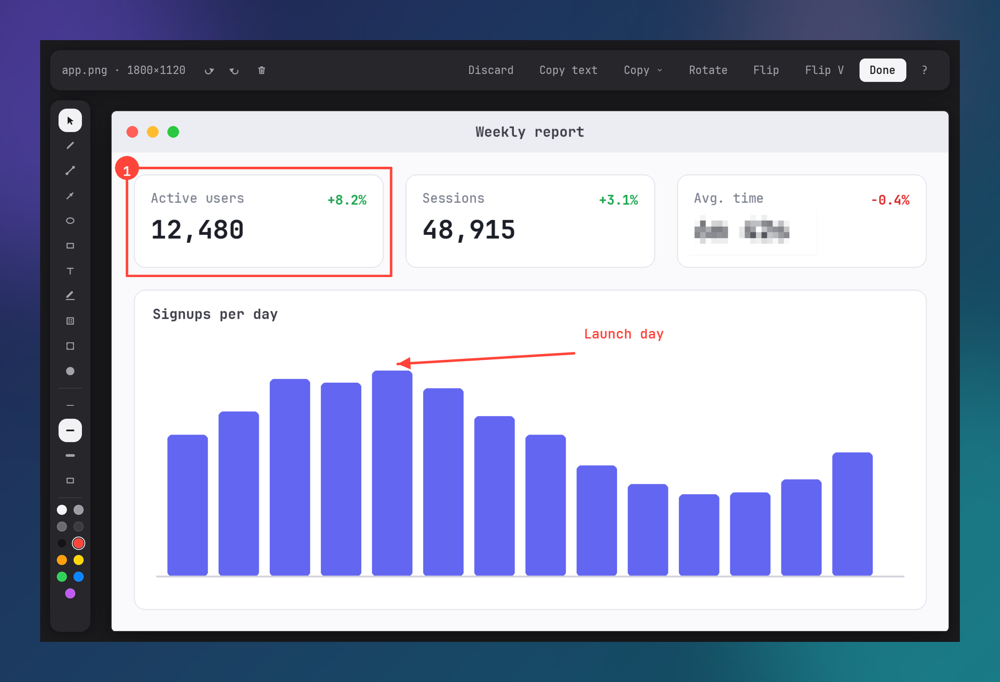

# Annotation Editor

The annotation editor provides vector markup tools, text entry, blur, and cropping over captured screenshots or image files on disk.

Open the editor via:
- Left-clicking a capture toast whose `toast_click_action` setting is set to `"markup"`.
- Clicking the pen icon in the toast action bar or selecting **Markup** from the toast context menu.
- Left-clicking a capture card in the Library window.
- Running `iris --annotate <path/to/file.png>` from the command line.

## Tools and Hotkeys

Select tools from the left sidebar or using single-letter hotkeys without modifiers:

| Key | Tool | Description |
| --- | --- | --- |
| `V` | Select | Hit-test, select, move, or delete committed annotations. |
| `P` | Pen | Freehand drawing with smoothed polyline paths. Minimum distance between points is 2 pixels. |
| `L` | Line | Straight two-point line segment. |
| `A` | Arrow | Directed line segment terminating in a filled vector arrowhead. |
| `E` | Ellipse | Ellipse bounded by the dragged rectangular extent. |
| `R` | Rectangle | Rectangle with outline stroke and optional interior fill. |
| `T` | Text | Click on the canvas to place an inline text entry box with a blinking caret. |
| `H` | Highlight | Semi-transparent horizontal or freehand highlighter stroke. |
| `B` | Blur | Pixelated rectangular area sampled from the composite image below the blur action. |
| `C` | Crop | Drag to define a rectangular crop region. Drag inside the box to reposition. Commit with `Enter` or discard with `Escape`. |
| `N` | Counter | Click to place circular numbered badges containing an integer that increments from 1. |

Switching tools settles any active text entry, committing non-empty text to the canvas.

## Tool Options

- **Fill shapes (`F`)**: Toggles interior fill on Rectangle and Ellipse tools. When disabled, the tool renders only the outline stroke.
- **Stroke width (`1`, `2`, `3`)**: Sets stroke width stop 0, 1, or 2 (multipliers 0.6x, 1.0x, and 1.8x over the image-relative base stroke width). Default stop is 1. Base stroke width scales with image pixel width (`clamp(width * 0.003, 2.0, 16.0)`).
- **Color palette**: Eleven color swatches arranged in a two-column grid on the sidebar: `#f5f5f7`, `#9c9ca2`, `#6b6b71`, `#3a3a3f`, `#141416`, `#ff453a` (default), `#ff9f0a`, `#ffd60a`, `#30d158`, `#0a84ff`, and `#bf5af2`. Clicking a swatch selects that color for subsequent vector shapes, text, and counter badges.

## Text Tool

Clicking the canvas while the Text tool is active sets an insertion point and displays a blinking caret (`▏`). The caret blinks at approximately 1 Hz via an internal timer.

- Type characters to append them to the text buffer.
- `Backspace` deletes the preceding character.
- `Enter` commits the text to the canvas.
- `Escape` cancels text entry and discards uncommitted buffer text.
- Clicking the backdrop outside the canvas commits non-empty text.
- Clicking the canvas or switching tools commits non-empty text before beginning the new action.
- Empty text buffers produce no committed action.

## Navigation and Canvas Controls

- **Zoom to fit (`0`)**: Resets zoom to 1.0 (fit-to-window scale) and resets pan offset to `(0, 0)`.
- **Zoom in (`+` or `=`)**: Multiplies zoom by 1.25, clamped to a maximum factor of 16.0x.
- **Zoom out (`-`)**: Divides zoom by 1.25, clamped to a minimum factor of 0.1x.
- **Mouse wheel zoom**: Scrolling adjusts zoom by factor 1.12 or 1/1.12, clamped between 0.1x and 16.0x. The zoom recomputes pan offsets to anchor the image point under the cursor.
- **Pan canvas**: Drag with the middle mouse button, or hold `Space` and drag with the left mouse button. Releasing `Space` or the mouse button ends panning.

## Edit Operations

- **Undo (`Ctrl+Z` or `Cmd+Z`)**: Reverts the most recent markup action, deletion, or move. A button is also available in the top bar.
- **Redo (`Ctrl+Shift+Z`, `Cmd+Shift+Z`, `Ctrl+Y`, or `Cmd+Y`)**: Re-applies the most recently undone action. A button is also available in the top bar.
- **Delete selected action (`Delete` or `Backspace`)**: Removes the currently selected annotation item when Select mode is active.
- **Clear all annotations**: The trash icon button in the top bar clears all committed actions and empties undo and redo stacks.
- **Commit crop (`Enter`)**: Flattens committed annotations into the base image, crops the composite image to the selection box (minimum 8x8 pixels), clears actions and undo stacks, updates dimensions, and recalculates fit scale.
- **Discard crop (`Escape`)**: Clears the active crop rectangle without modifying the image.
- **Shortcut sheet (`?` or `/`)**: Toggles the keyboard shortcut reference sheet.
- **Image transformations**: Top bar buttons apply whole-image operations that flatten committed annotations into the base:
  - **Rotate**: Rotates the image 90 degrees clockwise.
  - **Flip**: Mirrors the image horizontally.
  - **Flip V**: Mirrors the image vertically.

## Save and Discard

- **Save and close (`Ctrl+S`, `Cmd+S`, `Enter` without active crop, or "Done" button)**:
  1. Commits any active text entry and in-progress drawing action.
  2. Encodes the composite RGBA image to PNG bytes on a background thread.
  3. Overwrites the original image file at its path on disk.
  4. Generates a fresh thumbnail and updates the library entry in `library.json`.
  5. Copies the composite image pixels to the system clipboard.
  6. Initiates a 160 ms fade outro and closes the editor window.
- **Discard changes (`Escape` or "Discard" button)**:
  - Pressing `Escape` when the shortcut sheet, copy dropdown menu, active crop rectangle, or selected action is open dismisses that overlay or selection.
  - Pressing `Escape` with no active overlay or selection, or clicking **Discard**, closes the window immediately without writing changes to disk and without prompting for confirmation.

## Top Bar Copy Controls

- **Copy text**: Runs Tesseract OCR on the image file on a background thread, copies extracted text to the clipboard, and displays the character count in a status pill.
- **Copy menu**: Opens a dropdown menu with three export options:
  - **Copy Image**: Reads the image file from disk and copies its decoded pixels to the system clipboard.
  - **Copy File**: Copies the file to the system clipboard in platform file-list format for pasting into file managers.
  - **Copy Path**: Copies the canonical absolute path string of the image file to the system clipboard.

## Window

Drag the top bar to move the window. Double-click it to run the platform's title bar action: maximize on Linux and Windows, the Desktop & Dock setting on macOS. Drag an edge or corner to resize the window; it stops at 640×480. The top bar and the tool sidebar stay over a zoomed or panned image. See [Platform Backends](platforms.md#platform-capabilities-matrix) for the move and resize mechanism on each platform.

