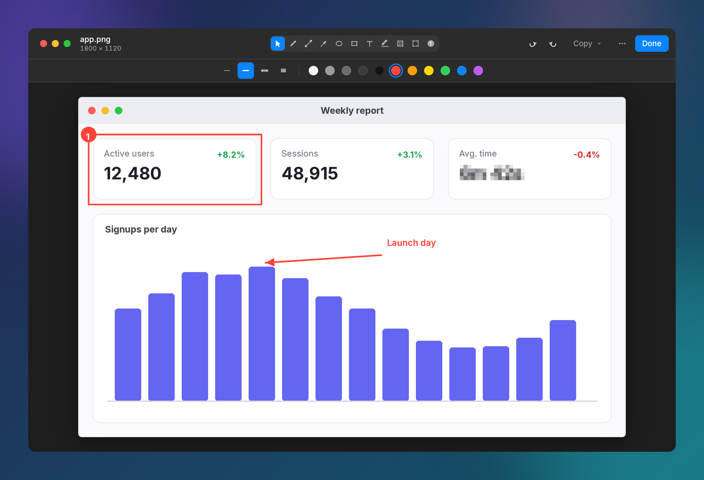

# Annotation Editor

The annotation editor provides vector markup tools, text entry, blur, and cropping over captured screenshots or image files on disk.

Open the editor via:
- Left-clicking a capture toast whose `toast_click_action` setting is set to `"markup"`.
- Clicking **Markup** (pen icon) in the toast's hover actions or selecting **Markup** from the toast context menu.
- Left-clicking a capture card in the Library window.
- Running `iris --annotate <path/to/file.png>` from the command line.

One editor is open per file. Opening a file that an editor already shows raises and focuses that editor, unless the editor is closing after **Done** or **Discard**.

Opened from a toast or a Library card, the editor grows out of the card's image over 380 ms while its background and controls fade in. On X11 with no compositing manager, the editor opens at rest and closes without its fade ([Pop-up Windows](platforms.md#linux-x11)).

## Layout

The toolbar holds, from left to right:

- The window controls, the file name, and the image size in pixels under it.
- The tools, one button each. A tool's tooltip shows its name and its key.
- **Undo** and **Redo**.
- **Copy**, a menu with **Copy Image**, **Copy File**, and **Copy Path** (see [Copy Controls](#copy-controls)).
- **More** (`…`), a menu with **Copy Text**, **Rotate Right**, **Flip Horizontal**, **Flip Vertical**, **Clear Markup**, **Keyboard Shortcuts**, and **Discard**.
- **Done**, which saves and closes the editor.

The tool options bar under the toolbar holds the three stroke widths, the fill toggle, and the color swatches (see [Tool Options](#tool-options)). The image sits under both bars, fit to the window with a 24-pixel margin on every side.

## Tools and Hotkeys

Select a tool in the toolbar or press its key without a modifier:

| Key | Tool | Description |
| --- | --- | --- |
| `V` | Select | Hit-test, select, move, or delete committed annotations. |
| `P` | Pen | Freehand drawing with smoothed polyline paths. Minimum distance between points is 2 pixels. |
| `L` | Line | Straight two-point line segment. |
| `A` | Arrow | Directed line segment terminating in a filled vector arrowhead. |
| `E` | Ellipse | Ellipse bounded by the dragged rectangular extent. |
| `R` | Rectangle | Rectangle with outline stroke and optional interior fill. |
| `T` | Text | Click on the canvas to place an inline text entry box with a blinking caret. |
| `H` | Highlight | Semi-transparent horizontal or freehand highlighter stroke. |
| `B` | Blur | Pixelated rectangular area sampled from the composite image below the blur action. |
| `C` | Crop | Drag to define a rectangular crop region. Drag inside the box to reposition. Commit with `Enter` or discard with `Escape`. |
| `N` | Counter | Click to place circular numbered badges containing an integer that increments from 1. |

Switching tools settles any active text entry, committing non-empty text to the canvas.

## Tool Options

- **Fill shapes (`F`)**: Toggles interior fill on Rectangle and Ellipse tools. When disabled, the tool renders only the outline stroke.
- **Stroke width (`1`, `2`, `3`)**: Sets stroke width stop 0, 1, or 2 (multipliers 0.6x, 1.0x, and 1.8x over the image-relative base stroke width). Default stop is 1. Base stroke width scales with image pixel width (`clamp(width * 0.003, 2.0, 16.0)`).
- **Color palette**: Eleven color swatches in the tool options bar: `#f5f5f7`, `#9c9ca2`, `#6b6b71`, `#3a3a3f`, `#141416`, `#ff453a` (default), `#ff9f0a`, `#ffd60a`, `#30d158`, `#0a84ff`, and `#bf5af2`. A blue ring marks the selected color. Clicking a swatch selects that color for subsequent vector shapes, text, and counter badges.

## Text Tool

Clicking the canvas while the Text tool is active sets an insertion point and displays a blinking caret (`▏`). The caret blinks at approximately 1 Hz via an internal timer.

- Type characters to append them to the text buffer.
- `Backspace` deletes the preceding character.
- `Enter` commits the text to the canvas.
- `Escape` cancels text entry and discards uncommitted buffer text.
- Clicking the backdrop outside the canvas commits non-empty text.
- Clicking the canvas or switching tools commits non-empty text before beginning the new action.
- Empty text buffers produce no committed action.

## Navigation and Canvas Controls

- **Zoom to fit (`0`)**: Resets zoom to 1.0 (fit-to-window scale) and resets pan offset to `(0, 0)`.
- **Zoom in (`+` or `=`)**: Multiplies zoom by 1.25, clamped to a maximum factor of 16.0x.
- **Zoom out (`-`)**: Divides zoom by 1.25, clamped to a minimum factor of 0.1x.
- **Mouse wheel zoom**: Scrolling adjusts zoom by factor 1.12 or 1/1.12, clamped between 0.1x and 16.0x. The zoom recomputes pan offsets to anchor the image point under the cursor.
- **Pan canvas**: Drag with the middle mouse button, or hold `Space` and drag with the left mouse button. Releasing `Space` or the mouse button ends panning.

## Edit Operations

- **Undo (`Ctrl+Z` or `Cmd+Z`)**: Reverts the most recent markup action, deletion, or move. **Undo** in the toolbar does the same.
- **Redo (`Ctrl+Shift+Z`, `Cmd+Shift+Z`, `Ctrl+Y`, or `Cmd+Y`)**: Re-applies the most recently undone action. **Redo** in the toolbar does the same.
- **Delete selected action (`Delete` or `Backspace`)**: Removes the currently selected annotation item when Select mode is active.
- **Clear Markup** (More menu): Clears all committed actions and empties the undo and redo stacks. The row is dimmed and inert while the image has no markup.
- **Commit crop (`Enter`)**: Flattens committed annotations into the base image, crops the composite image to the selection box (minimum 8x8 pixels), clears actions and undo stacks, updates dimensions, and recalculates fit scale.
- **Discard crop (`Escape`)**: Clears the active crop rectangle without modifying the image.
- **Shortcut sheet (`?` or `/`, or Keyboard Shortcuts in the More menu)**: Toggles the keyboard shortcut reference sheet.
- **Image transformations** (More menu): Whole-image operations that flatten committed annotations into the base:
  - **Rotate Right**: Rotates the image 90 degrees clockwise.
  - **Flip Horizontal**: Mirrors the image horizontally.
  - **Flip Vertical**: Mirrors the image vertically.

## Save and Discard

- **Save and close** (`Ctrl+S`, `Cmd+S`, `Ctrl+W`, `Cmd+W`, `Enter` without active crop, or **Done**):
  1. Commits any active text entry and in-progress drawing action.
  2. Encodes the composite RGBA image to PNG bytes on a background thread.
  3. Overwrites the original image file at its path on disk.
  4. Generates a fresh thumbnail and updates the library entry in `library.json`.
  5. Copies the composite image pixels to the system clipboard.
  6. Initiates a 160 ms fade outro and closes the editor window.
- **Discard changes** (`Escape`, or **Discard** in the More menu):
  - Pressing `Escape` when the shortcut sheet, the Copy or More menu, an active crop rectangle, or a selected action is open dismisses that overlay or selection.
  - Pressing `Escape` with no active overlay or selection, or clicking **Discard**, fades out the window over 160 ms and closes it without writing changes to disk and without prompting for confirmation.

## Copy Controls

- **Copy Text** (More menu): Runs Tesseract OCR on the image file on a background thread, copies extracted text to the clipboard, and displays the character count in a status pill.
- **Copy** (toolbar): Opens a menu with three export options. Each reads the image file on disk, so markup not yet saved with **Done** is not included:
  - **Copy Image**: Reads the image file from disk and copies its decoded pixels to the system clipboard.
  - **Copy File**: Copies the file to the system clipboard in platform file-list format for pasting into file managers.
  - **Copy Path**: Copies the canonical absolute path string of the image file to the system clipboard.

## Window

Drag the toolbar to move the window. Double-click it to run the platform's title bar action: maximize on Linux and Windows, the Desktop & Dock setting on macOS. Drag an edge or corner to resize the window; it stops at 760×480. The toolbar and the tool options bar stay over a zoomed or panned image. See [Platform Backends](platforms.md#platform-capabilities-matrix) for the move and resize mechanism on each platform.

