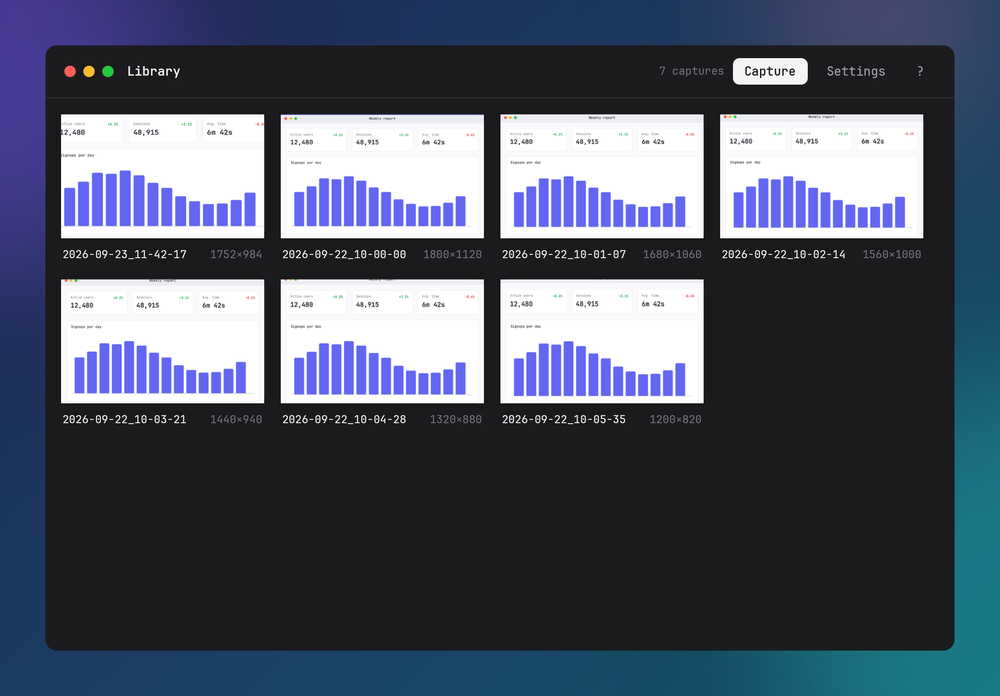

# Capture Library

The library window displays stored screenshots, thumbnail previews, file metadata, and batch management actions.

Open the library via:
- Command-line interface: `iris --library`
- System tray context menu: **Library** item
- Home window: **Library** tile

One library window is open at a time. Opening the library while it is open raises and focuses that window.

## Header and Toolbar

The window header uses the client-side decorated frame (56 pixels high) containing traffic light window controls, the title **Library**, and action clusters:

- **When no items are selected**:
  - Capture count indicator (for example, `42 captures`, or empty state message).
  - **Capture**: Starts a region capture overlay via `iris --capture`.
  - **Settings**: Opens the Settings window ([configuration.md#settings-window](configuration.md#settings-window)).
  - **?**: Toggles the keyboard shortcut reference sheet.
- **When one or more cards are selected**:
  - Selection count label (for example, `3 selected`).
  - **Copy**: Copies the selection to the system clipboard. A single selection copies the decoded image pixels; multiple items copy file paths in platform file-list format.
  - **Delete**: Deletes selected image files and their cached thumbnails from disk, removes entries from `library.json`, and clears the selection.
  - **Clear**: Clears the current selection.

## Thumbnail Grid and Cards

The body contains a responsive multi-column grid of capture cards with 16-pixel padding and gaps:

- **Ordering**: Sorted by creation timestamp in descending order (newest captures first).
- **Auto-refresh**: Polls `library.json` on a 1.5-second timer. Captures added, modified, or removed by other processes update automatically without restarting the window.
- **Card layout**: Each card is 216 pixels wide and contains:
  - Top thumbnail container (132 pixels high) displaying the cached thumbnail image.
  - Top-left selection circle checkbox.
  - Bottom metadata row showing the file name without its `.png` extension and the pixel dimensions (`<width>×<height>`). A name longer than the space beside the dimensions keeps its start and end around an ellipsis, so the time and any collision suffix (`-2`) stay visible.

## Selection Model and Gestures

- **Open in Editor**: Left-clicking a card without modifier keys opens the capture in the annotation editor ([editor.md](editor.md)) with an expand-morph animation.
- **Toggle selection**: `Ctrl`-click (Linux and Windows) or `Cmd`-click (macOS) toggles selection of the clicked card and sets the selection anchor. Clicking the check circle on a card also toggles selection without opening the editor.
- **Range selection**: `Shift`-click selects all cards between the current anchor index and the clicked card index, inclusive.
- **Select all (`Ctrl+A` or `Cmd+A`)**: Selects every capture currently present in the library.
- **Clear selection (`Escape`)**: Clears the active selection. If no items are selected and the shortcut sheet is closed, `Escape` closes the library window.
- **Rubber-band selection**: Left-clicking on empty grid space and dragging draws a rectangular marquee. Releasing the mouse button selects all cards whose boundaries intersect the rectangle. A drag under 4 pixels is treated as a click on empty space and clears any existing selection.
- **Direct file drag-out**: Pressing and dragging a card thumbnail by at least 8 pixels initiates a system drag-and-drop operation. If the card is part of an active multi-card selection, all selected files are included in the drag payload; otherwise, only the dragged card file is included. On Linux X11, the drag payload includes an RGBA thumbnail drag icon.

## Card Hover Actions

Hovering the cursor over a card lifts the card preview and displays an overlay action bar in the bottom-right corner of the thumbnail:

1. **Copy** (copy icon): Reads the PNG file on a background thread and copies decoded image pixels to the system clipboard.
2. **Reveal in folder** (folder icon): Opens the system file manager with the capture file highlighted:
   - Linux: Sends a D-Bus message to `org.freedesktop.FileManager1.ShowItems`. If unavailable, falls back to `xdg-open` on the containing folder.
   - macOS: Runs `/usr/bin/open -R <path>`. If the file does not exist, opens the parent directory.
   - Windows: Calls the Win32 Shell API `SHOpenFolderAndSelectItems`. If unavailable, falls back to launching `explorer.exe <folder>`.
   Right-clicking anywhere on a card also invokes this reveal action.
3. **Delete** (close icon): Removes the image file and its thumbnail from disk and deletes the entry from `library.json`.

## Keyboard Shortcuts

| Shortcut | Action |
| --- | --- |
| `Ctrl+A` / `Cmd+A` | Select all captures in the library |
| `Delete` / `Backspace` | Delete selected captures from disk and library |
| `Escape` | Dismiss shortcut sheet, clear active selection, or close library window |
| `?` or `/` | Toggle keyboard shortcuts reference sheet |
| Title bar double-click | Trigger platform window action: toggle maximize on Linux and Windows, or invoke the system Desktop & Dock preference on macOS |

Window traffic light controls in the top-left corner offer standard actions: close (red), minimize (yellow), and zoom/maximize (green, which toggles fullscreen on macOS and toggles maximize on Linux and Windows).

Drag the toolbar to move the window. Drag an edge or corner to resize it; the window stops at 640×480.

## Storage Paths

The library manages two on-disk storage locations: metadata in `data_dir()` and cached thumbnails in `cache_dir()/thumbs`.

Default paths derive from the `directories` crate using the qualifier, organization, and application triple `("", "", "dev.iris.app")`:

| Platform | Metadata Path (`library.json`) | Thumbnail Cache Directory |
| --- | --- | --- |
| Linux | `~/.local/share/dev.iris.app/library.json` (`$XDG_DATA_HOME/dev.iris.app/library.json`) | `~/.cache/dev.iris.app/thumbs/` (`$XDG_CACHE_HOME/dev.iris.app/thumbs/`) |
| macOS | `~/Library/Application Support/dev.iris.app/library.json` | `~/Library/Caches/dev.iris.app/thumbs/` |
| Windows | `%APPDATA%\dev.iris.app\data\library.json` (`{FOLDERID_RoamingAppData}\dev.iris.app\data\library.json`) | `%LOCALAPPDATA%\dev.iris.app\cache\thumbs\` (`{FOLDERID_LocalAppData}\dev.iris.app\cache\thumbs\`) |

When the `IRIS_HOME` environment variable is defined and non-empty, paths resolve to subdirectories of `$IRIS_HOME` across all platforms:
- Metadata: `$IRIS_HOME/data/library.json`
- Thumbnail cache: `$IRIS_HOME/cache/thumbs/`

Each thumbnail file is stored in PNG format named after an FNV-1a hash of the source image path (`<hash>.png`). A thumbnail is the capture box-filtered to cover 432×264 pixels, the card's image area at 2x, and cropped to that aspect around its center; a capture smaller than that box is cropped, not enlarged. A thumbnail of another size, such as one written by an earlier release, is rebuilt from the capture when the library shows it. The library store retains up to 200 entries.
