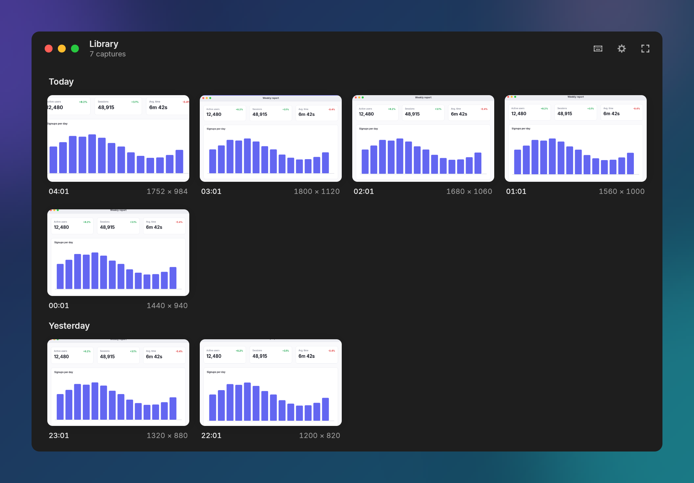

# Capture Library

The library window displays stored screenshots, thumbnail previews, file metadata, and batch management actions.

Open the library via:
- Command-line interface: `iris --library`
- System tray context menu: **Library** item
- Home window: **Library** tile

One library window is open at a time. Opening the library while it is open raises and focuses that window.

## Toolbar

The window's title bar is a unified toolbar, 52 pixels high, with the traffic light window controls, the title **Library**, and under it the capture count (for example, `42 captures`) once `library.json` is read. The trailing buttons depend on the selection:

- **No selection**:
  - **Keyboard Shortcuts** (keyboard icon): toggles the shortcut reference sheet.
  - **Settings** (gear icon): opens the Settings window ([configuration.md#settings-window](configuration.md#settings-window)).
  - **New Screenshot** (viewfinder icon): starts a region capture, as `iris --capture` does.
- **One or more cards selected**:
  - The selection count (for example, `3 selected`).
  - **Copy**: copies the selection to the clipboard. One capture copies its decoded pixels; several copy their file paths in the platform file-list format.
  - **Move to Trash**: moves the selected captures to the system trash ([Move to Trash](#move-to-trash)).
  - **Done**: clears the selection.

A pointer that rests on a toolbar button for half a second shows a tooltip with the button's name and its keyboard shortcut.

## Grid

The grid lists captures newest first under a title per local day: **Today**, **Yesterday**, then the weekday and date (`Tuesday, October 6`), with the year for a day in another year. The titles change at local midnight while the window is open. Each day starts a new row. The columns are 216 pixels wide with 16 pixels between them, as many as fit the window with 20 pixels of margin on each side, and the grid is centered in the window.

- **Auto-refresh**: A capture that the daemon saves, re-saves from the editor, or moves to the trash shows in the grid at once. A capture file that another program deletes, or moves out of its folder, leaves the grid at once: the library watches the folders that hold its captures. Where the system refuses the watch, the library reads `library.json` every 1.5 seconds and writes the reason to the log. A watch does not report a change that another computer makes to a folder on a network filesystem.
- **Opening**: The window opens empty and shows the grid when `library.json` is read on a background thread. Thumbnails decode in the background and appear as each lands.
- **Empty library**: With no captures, the window shows a viewfinder glyph, **No Captures**, and the capture hotkey.
- **Scrolling**: A mouse wheel tick scrolls the grid over about 120 ms, and ticks during the motion extend it. Touchpad scrolling follows the fingers. When the system requests reduced motion, a wheel tick scrolls at once. A hairline under the toolbar marks content scrolled under it.

Each card is 216 pixels wide:

- The thumbnail, 132 pixels high, with 8-pixel corners and a hairline border. A selected card has a 2-pixel accent ring 2 pixels outside the thumbnail.
- Under it, the local time the capture was taken (`14:02`) and its pixel dimensions (`1920 × 1080`). A pointer resting on this line shows the file name.

## Selection

- **Open in Editor**: A click on a card without modifier keys opens the capture in the annotation editor ([editor.md](editor.md)) with an expand-morph animation.
- **Toggle selection**: `Ctrl`-click (Linux and Windows) or `Cmd`-click (macOS) toggles the clicked card and sets the range anchor.
- **Range selection**: `Shift`-click selects every card from the anchor to the clicked card, inclusive.
- **Arrow keys**: Left and Right move the selection to the previous and next capture across rows and days. Up and Down move to the card in the same column of the row above or below; a shorter row takes its last card. With no selection, an arrow key selects the first capture. `Shift` with an arrow key extends the selection from the anchor. The grid scrolls the least distance that shows the selected card, with its day title when the card is in the day's first row.
- **Select all (`Ctrl+A` or `Cmd+A`)**: Selects every capture in the library.
- **Clear selection (`Escape`)**: Clears the selection. With no selection and the shortcut sheet closed, `Escape` closes the window.
- **Rubber-band selection**: A press on empty grid space and a drag draws a marquee. Releasing the button selects every card the marquee touches. A drag under 4 pixels is a click on empty space and clears the selection.
- **File drag-out**: A press on a card and a drag of 8 pixels or more starts a system drag-and-drop. A card in a multi-card selection drags every selected file; any other card drags its own file. On Linux X11, the drag shows the thumbnail as its icon.

## Card Actions

A pointer on a card lifts its shadow and shows three buttons in the thumbnail's bottom-right corner, each with a tooltip:

1. **Copy** (copy icon): copies the capture's decoded pixels to the clipboard. The PNG decodes on a background thread.
2. **Show in Folder** (folder icon; **Show in Finder** on macOS, **Show in File Explorer** on Windows): opens the system file manager with the capture selected:
   - Linux: sends `org.freedesktop.FileManager1.ShowItems` over D-Bus. Without that service, runs `xdg-open` on the containing folder.
   - macOS: runs `/usr/bin/open -R <path>`. If the file does not exist, opens the parent folder.
   - Windows: calls `SHOpenFolderAndSelectItems`. Without it, runs `explorer.exe <folder>`.
3. **Move to Trash** (trash icon): moves the capture to the system trash ([Move to Trash](#move-to-trash)).

A right-click on a card opens a context menu at the pointer: **Open**, **Quick Look**, **Copy**, **Show in Folder**, and **Move to Trash**. A card outside the selection becomes the selection first; a card inside it keeps the selection, and **Copy** and **Move to Trash** act on every selected capture. A click outside the menu or `Escape` closes it.

## Quick Look

`Space` shows the selected capture over the grid at its own pixel size, scaled down to fit the window and never up, with its file name and dimensions under it. The card's thumbnail stands in until the full image decodes on a background thread. Arrow keys move the selection and the preview with it. `Return` opens the previewed capture in the editor. `Space`, `Escape`, or a click closes the preview.

## Move to Trash

**Move to Trash** moves each capture file to the system trash, where the file manager can restore it, then drops its entry from `library.json` and deletes its cached thumbnail. The trash is the freedesktop.org trash on Linux (`$XDG_DATA_HOME/Trash`, or `.Trash-$UID` at the top of another volume), the Finder Trash on macOS, and the Recycle Bin on Windows. On macOS the move goes through `NSFileManager`, not Finder: it plays no sound and needs no Automation permission, and Finder's **Put Back** command may be unavailable for the moved file; drag the file out of the Trash to restore it. A capture file that no longer exists drops its entry. A capture the system fails to move keeps its file, its entry, and its card, and the status pill shows the reason; when several captures were moved, it starts with `N of M captures stayed.` The toast's **Move to Trash** action takes the same path.

## Keyboard Shortcuts

| Shortcut | Action |
| --- | --- |
| Arrow keys | Move the selection; `Shift` extends it |
| `Return` | Open the selected capture in the editor |
| `Space` | Show or close Quick Look |
| `Ctrl+A` / `Cmd+A` | Select every capture |
| `Ctrl+C` / `Cmd+C` | Copy the selection |
| `Delete` / `Backspace` | Move the selection to the trash |
| `Ctrl+,` / `Cmd+,` | Open Settings |
| `Ctrl+W` / `Cmd+W` | Close the window |
| `Escape` | Close the menu, Quick Look, or the shortcut sheet; clear the selection; or close the window |
| `?` or `/` | Toggle the shortcut reference sheet |
| Title bar double-click | Run the platform title bar action: toggle maximize on Linux and Windows, or the action set in the macOS Desktop & Dock settings |

The traffic lights in the top-left corner close (red), minimize (yellow), and zoom (green: fullscreen on macOS, maximize on Linux and Windows) the window. On X11 with no compositing manager, the window manager frames the window and the toolbar has no traffic lights ([Window Frame](platforms.md)).

Drag the toolbar to move the window. Drag an edge or corner to resize it; the window stops at 640×480.

## Storage Paths

The library manages two on-disk storage locations: metadata in `data_dir()` and cached thumbnails in `cache_dir()/thumbs`.

Default paths derive from the `directories` crate using the qualifier, organization, and application triple `("", "", "dev.iris.app")`:

| Platform | Metadata Path (`library.json`) | Thumbnail Cache Directory |
| --- | --- | --- |
| Linux | `~/.local/share/dev.iris.app/library.json` (`$XDG_DATA_HOME/dev.iris.app/library.json`) | `~/.cache/dev.iris.app/thumbs/` (`$XDG_CACHE_HOME/dev.iris.app/thumbs/`) |
| macOS | `~/Library/Application Support/dev.iris.app/library.json` | `~/Library/Caches/dev.iris.app/thumbs/` |
| Windows | `%APPDATA%\dev.iris.app\data\library.json` (`{FOLDERID_RoamingAppData}\dev.iris.app\data\library.json`) | `%LOCALAPPDATA%\dev.iris.app\cache\thumbs\` (`{FOLDERID_LocalAppData}\dev.iris.app\cache\thumbs\`) |

When the `IRIS_HOME` environment variable is defined and non-empty, paths resolve to subdirectories of `$IRIS_HOME` across all platforms:
- Metadata: `$IRIS_HOME/data/library.json`
- Thumbnail cache: `$IRIS_HOME/cache/thumbs/`

Each thumbnail file is stored in PNG format named after an FNV-1a hash of the source image path (`<hash>.png`). A thumbnail is the capture box-filtered to cover 432×264 pixels, the card's image area at 2x, and cropped to that aspect around its center; a capture smaller than that box is cropped, not enlarged. A thumbnail of another size, such as one written by an earlier release, is rebuilt from the capture when the library shows it. The library store retains up to 200 entries.
