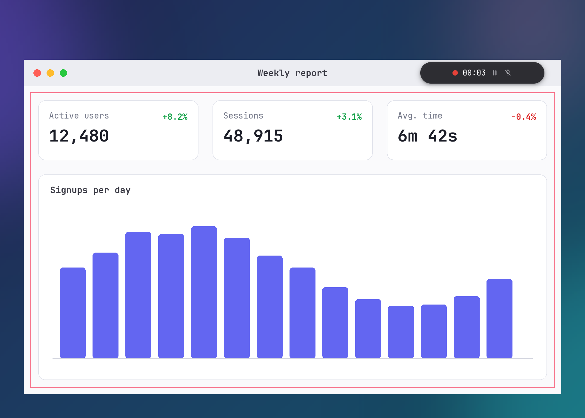

# Screen Recording

iris records selected windows, screen regions, or displays using platform capture interfaces and `ffmpeg`.



## Recording Modes

### Window Recording

Start window recording through any of the following triggers:
- Keybind: `Ctrl+Shift+R` (configured by `record_hotkey` in [configuration.md#keyboard](configuration.md#keyboard))
- Command-line interface: `iris --record-window` (see [cli.md#command-reference](cli.md#command-reference))
- Home window: **Record Window** tile
- System tray menu: **Record window**

Stop an active recording through any of the following triggers:
- Press `Ctrl+Shift+R` (or the configured `record_hotkey`)
- Run `iris --record-window`
- Click **Record window** in the system tray menu
- Click **Record Window** in the Home window
- Run `iris --quit` (saves the recording before process exit)

A recording also ends automatically when its target window closes, its target window minimizes, or its compositor session ends.

The daemon saves every recording before it exits: the recording in progress, and a stopped recording whose segments are still being joined. This applies to `iris --quit` and, on Linux, to the exit that follows the loss of the X server or Wayland compositor. When the X server exits during an X11 recording, the recording ends and its file is saved before the daemon exits.

Platform behavior for window recording:
- **Linux (X11)**: Activates a window picker. The pointer cursor changes to a crosshair. Click any window to select it as the recording target. Press `Escape` during selection to cancel without saving a file. No indicator chip shows during selection; the chip opens over the target once it is picked, and its timer starts then. Four red border strips (`#f7768e`, 3 pixels wide) outline the target window. The border strips set an empty input region via the XFixes shape extension so cursor events pass through to underlying windows. The target window is redirected via the XComposite extension (`composite_redirect_window`). Frame capture reads the window pixmap via X11 shared memory (MIT-SHM). Occluding windows and the desktop background do not enter the recording. A tracking thread monitors `ConfigureNotify` events and updates border strip geometry and indicator chip placement to follow window movement. When the target window minimizes (reporting zero width or height) or closes, recording ends and saves accumulated frames.
- **Linux (Wayland)**: Invokes `org.freedesktop.portal.ScreenCast` through `ashpd` with `SourceType::Window` and `CursorMode::Hidden`. The compositor presents its native window selection dialog. Dismissing the selection dialog cancels recording without saving a file. Video frames arrive over PipeWire as `MemPtr`, `MemFd`, or `DMA-buf` (imported through EGL and read with `glReadPixels`, or read through CPU mapping). The floating indicator chip is disabled on Wayland. When the compositor closes the portal session, recording ends and saves accumulated frames.
- **Windows**: Records the desktop via `ffmpeg` using `gdigrab` (`-f gdigrab -framerate <fps> -draw_mouse 1 -i desktop`). Window-specific capture is unavailable; full desktop capture is recorded. The floating indicator chip opens inside the top-right corner of the primary display.
- **macOS**: Records the main display desktop via `ffmpeg` using `avfoundation` (`-f avfoundation -framerate <fps> -capture_cursor 1 -i <screen>:<mic|none>`). Window-specific capture is unavailable; main display capture is recorded. The floating indicator chip opens inside the top-right corner of the primary display.

### Region Recording

```sh
iris --record-region
```

Opens the selection overlay in region-pick mode (`RecordPick`). Drag a bounding box or select a detected window rectangle. Press `Enter` or double-click to commit the selection. Press `Escape` or click the right mouse button to cancel.

If the selection width or height is zero or negative, iris rejects the command with `empty region {w}x{h}`.

Platform behavior for region recording:
- **Linux (X11)**: Reads pixels from the root window bounding box using X11 shared memory (MIT-SHM). Static border strips outline the rectangle, and the indicator chip opens above its top-right corner.
- **Linux (Wayland)**: Region recording is unavailable. `iris --record-region` returns the error `region recording needs X11; on Wayland record a window`.
- **Windows**: Executes `ffmpeg` with `gdigrab`:
  ```sh
  ffmpeg -hide_banner -loglevel error -nostats -y -f gdigrab -framerate <fps> -draw_mouse 1 -offset_x <x> -offset_y <y> -video_size <width>x<height> -i desktop
  ```
  Width and height round down to even integers (`even(n) = (n & !1).max(2)`). If microphone recording is active, appends `-f dshow -i audio=<device>`, resolving the first audio device listed by `ffmpeg -f dshow -list_devices true`.
- **macOS**: Determines the display containing the rectangle center. Executes `ffmpeg` with `avfoundation`:
  ```sh
  ffmpeg -hide_banner -loglevel error -nostats -y -f avfoundation -framerate <fps> -capture_cursor 1 -i <screen>:<mic|none> -vf crop=<width>:<height>:<x>:<y>
  ```
  Crop width and height round down to even integers. If microphone recording is active, resolves the first audio device listed by `ffmpeg -f avfoundation -list_devices true`.

## Session Controls

Session controls execute while a recording runs:
- **Pause and Resume**: Run `iris --record-pause` or click the pause button on the floating indicator chip.
- **Microphone Toggle**: Run `iris --record-mic` or click the microphone button on the floating indicator chip.

If no recording is active, `iris --record-pause` and `iris --record-mic` return the error `no recording is active`. Both commands require a running daemon; executing them with no daemon running prints `iris: no iris daemon is running` to stderr and exits with status 1.

### Pause and Resume

- **Linux (X11 and Wayland)**: Pausing closes the current recording segment. Frames captured while paused are dropped. The elapsed timer suspends advancing. Resuming opens a new recording segment, writing the last frame of the previous segment at the resume timestamp so a static screen remains visible.
- **Windows and macOS**: Pausing writes `q` to standard input of `ffmpeg` and waits up to 10 seconds for process exit. Resuming spawns a new `ffmpeg` segment process writing `<output>.part<N>.mkv`.

### Microphone Toggle

- **Linux (X11 and Wayland)**: Toggling the microphone closes the current segment and opens a new segment with the updated audio input state. For formats without audio tracks (`gif`), `iris --record-mic` returns the error `a gif recording has no audio track`.
- **Windows and macOS**: Toggling the microphone closes the active `ffmpeg` segment and spawns a new segment with or without the audio device input option. If paused, toggling the microphone updates state without starting an encoder process until resume. For formats without audio tracks (`gif`), `iris --record-mic` returns the error `a gif recording has no audio track`.

## Floating Indicator Chip

During recording on X11, Windows, and macOS, a floating indicator chip displays on screen. The indicator chip is not opened on Wayland.

Geometry and layout:
- Width: 208.0 logical pixels. Height: 36.0 logical pixels. Transparent bleed margin: 16.0 logical pixels on all sides (total window bounds: 240.0 by 68.0 logical pixels).
- Shape: Full pill (`rounded_full`) with elevated background fill (`theme::alpha(theme::BG_ELEV, 0.92)`) and a tight drop shadow (`theme::shadow_tight()`) that ends inside the bleed margin.
- Placement: The window's bottom-right corner sits on the top-right corner of the recorded area, so the pill sits one bleed margin inside the area's right edge and above its top edge. When the monitor has no room above the area, the chip sits below the area's bottom-right corner instead; when neither fits, it sits inside the area's top edge. The chip starts no further left than the area and stays on the monitor holding the area's center, or on the primary display when no monitor holds it. Without a recorded area (window recording on Windows and macOS), the area is the primary display.

Components:
- **Status dot**: 9×9 logical pixel circular indicator, solid red (`theme::DANGER`) while recording and faint gray (`theme::FG_FAINT`) at 0.35 opacity while paused.
- **Elapsed timer**: Renders elapsed duration as `MM:SS`. Time spent paused is not counted. The chip draws a frame when the timer reaches the next second and when the pause or microphone state changes; a paused chip draws no frames until its state changes.
- **Pause button**: Clickable icon button. Displays the Pause icon while recording and the Play icon while paused. Clicking sends `Command::RecordPause` to the daemon.
- **Microphone button**: Clickable icon button. Displays the Mic icon when microphone capture is active and the MicOff icon when muted. Clicking sends `Command::RecordMic` to the daemon. Rendered only when `recording_format` supports audio (`mp4` or `webm`). For `gif` recordings, the button is omitted.

Window management and capture exclusion:
- **Linux (X11)**: Border strips and the indicator chip window sit outside the recorded window pixmap. The border thread repositions the chip window via `configure_window` by XID. Window decorations are removed via `_MOTIF_WM_HINTS`. A region recording reads the screen, so a chip placed inside the area (when the monitor has no room above or below it) appears in the recording.
- **Windows**: Configured with `SetWindowDisplayAffinity(hwnd, WDA_EXCLUDEFROMCAPTURE)`. Win32 GDI `BitBlt`, `gdigrab`, and Desktop Window Manager exclude the chip window from captured frames.
- **macOS**: Configured with `[ns_window setSharingType: 0]` (`NSWindowSharingNone`). CoreGraphics and `avfoundation` exclude the chip window from captured frames.
- **Linux (Wayland)**: The indicator chip window is not opened.

## Encoding and Container Pipeline

Screen recordings are encoded as runs of Matroska segments (`part0.mkv`, `part1.mkv`, ...) and joined into the final container file when recording stops.

### Matroska Segment Recording

On Linux (X11 and Wayland), captured frames are streamed to `ffmpeg` standard input wrapped in Matroska (`.mkv`) container packets:
- Header: Declares `DocType` `matroska`, `TimestampScale` 1,000,000 ns (1 millisecond), video track `CodecID` `V_UNCOMPRESSED`, and `ColourSpace` matching the pixel layout (`BGR\0`, `RGB\0`, `BGR24`, or `RGB24`).
- Clusters: Each frame is written inside a Matroska Cluster with an 8-byte length header and a single keyframe SimpleBlock stamped with elapsed capture time in milliseconds.
- Variable frame rate: Because each frame includes its capture timestamp, unchanged screens produce no frames. `ffmpeg` receives `-fps_mode vfr` (falling back to `-vsync vfr` on versions prior to 5.1) and `-enc_time_base:v 1:1000`.
- Frame reads on X11: A frame is read only after XDamage reports a change inside the recorded window or region, at most `recording_fps` times a second. A paused recording releases its damage subscription and reads no frames.
- Segment input arguments:
  ```sh
  ffmpeg -hide_banner -loglevel error -y -copyts -probesize 32 -analyzeduration 0 -f matroska -i pipe:0
  ```
- Microphone capture on Linux: Records the default PulseAudio source via `-f pulse -name iris -i default`. Wallclock timestamps are synchronized to the video timeline via `-thread_queue_size 512 -itsoffset -<seconds>.<microseconds>`.

### Canvas and Dimension Rules

The first captured frame sets the recording canvas:
- Width and height round down to even integers: `even(n) = (n & !1).max(2)`.
- If subsequent frames change dimensions (such as window resizing on X11), the current segment closes and a new segment opens. A video filter scales and pads frames onto the established canvas:
  - Crop odd edges: `crop={ew}:{eh}:0:0`
  - Scale to fit: `scale={sw}:{sh}:flags=bicubic`
  - Pad to canvas centered on black: `pad={cw}:{ch}:{x}:{y}:black`

### Segment Joining

When recording stops, iris joins all accumulated segments into the target file:
- **Single segment**: Read directly via `-i <segment>`.
- **Multiple segments**: Written to a temporary concat file (`parts.txt`) using the `concat` demuxer (`-f concat -safe 0 -i <list>`).
- **Silent audio track padding**: If any segment contains an audio track while other segments lack audio (such as after toggling the microphone), iris generates a silent audio track for segments lacking audio before concatenation:
  ```sh
  ffmpeg -hide_banner -loglevel error -y -i <segment> -f lavfi -i anullsrc=r=48000:cl=stereo -map 0:v -map 1:a -c:v copy -c:a <codec> -b:a <bitrate> -ar 48000 -ac 2 -shortest -f matroska <silent_segment>
  ```
- **Container join passes**:
  - **MP4**: Stream copies video and audio into an MP4 container with faststart flags:
    ```sh
    ffmpeg -hide_banner -loglevel error -y <input> -map 0 -c copy -movflags +faststart -f mp4 <output>
    ```
  - **WebM**: Stream copies video and audio into a WebM container:
    ```sh
    ffmpeg -hide_banner -loglevel error -y <input> -map 0 -c copy -f webm <output>
    ```
  - **GIF**: Executes a two-pass palette encode. Clamps output width to at most 1280 pixels (`scale='min(iw,1280)':-2:flags=lanczos`):
    - Pass 1 (palette generation):
      ```sh
      ffmpeg -hide_banner -loglevel error -y <input> -vf "scale='min(iw,1280)':-2:flags=lanczos,palettegen" -frames:v 1 -update 1 <palette.png>
      ```
    - Pass 2 (palette application):
      ```sh
      ffmpeg -hide_banner -loglevel error -y <input> -i <palette.png> -lavfi "[0:v]scale='min(iw,1280)':-2:flags=lanczos[x];[x][1:v]paletteuse=diff_mode=rectangle" <vfr_args> -f gif <output>
      ```
- **Cleanup and error preservation**: On successful join, intermediate segment files are deleted. If the join fails, segment files remain on disk, and iris reports the error with segment file paths. If an active recording terminates unexpectedly, iris joins segments recorded prior to failure and reports where the partial file was saved.

## Output Containers and Encoders

Configure recording parameters in `config.toml`:

```toml
recordings_dir = "~/Videos/iris"
recording_fps = 30
recording_format = "mp4"        # mp4 | gif | webm
recording_encoder = "auto"      # auto | libx264 | nvenc
record_mic_default = false
```

### Formats and Codecs

- **MP4 (`mp4`)**:
  - Container extension: `.mp4`.
  - Video codec: `h264_nvenc` or `libx264`. Encodes to `yuv420p` pixel format.
  - Audio codec: AAC (`-c:a aac -b:a 128k -ar 48000 -ac 2`).
- **WebM (`webm`)**:
  - Container extension: `.webm`.
  - Video codec: VP9 via `libvpx-vp9` (`-c:v libvpx-vp9 -deadline realtime -cpu-used 8 -row-mt 1 -b:v 0 -crf 32 -pix_fmt yuv420p`).
  - Audio codec: Opus (`-c:a libopus -b:a 96k -ar 48000 -ac 2`).
- **GIF (`gif`)**:
  - Container extension: `.gif`.
  - Segment intermediate codec: Lossless RGB H.264 via `libx264rgb` (`-c:v libx264rgb -preset ultrafast -qp 0 -bf 0`).
  - Audio: None. GIF recordings do not contain audio tracks.
  - Framerate: Clamped to at most 20 fps (`fps.min(20)`).

### Video Encoders

- `auto`: When encoding MP4 video, iris checks whether frame dimensions meet the hardware minimum of 145×49 pixels and executes a probe command:
  ```sh
  ffmpeg -hide_banner -loglevel error -f lavfi -i color=black:s=256x256:d=0.1:r=1 -frames:v 1 -c:v h264_nvenc -f null -
  ```
  If NVENC is available and frame dimensions are at least 145×49, iris selects `h264_nvenc`:
  ```sh
  -c:v h264_nvenc -preset p4 -cq 23 -bf 0 -pix_fmt yuv420p
  ```
  No H.264 encoder uses B-frames (`-bf 0`). If frame dimensions are smaller than 145×49 or NVENC is unavailable, iris selects `libx264`:
  ```sh
  -c:v libx264 -preset veryfast -crf 20 -bf 0 -pix_fmt yuv420p
  ```
- `libx264`: Forces software CPU encoding via `libx264` (`-preset veryfast -crf 20 -bf 0 -pix_fmt yuv420p`).
- `nvenc`: Forces `h264_nvenc` when frame dimensions are at least 145×49, falling back to `libx264` for smaller frames.
- Probe warming: When a recording picker opens (such as region pick overlay or window recording), iris warms encoder and VFR probe checks on a background thread (`iris-rec-probe`) so the first recorded segment begins without delay.

### Framerate Bounds

The `recording_fps` setting defaults to 30. The configuration settings window clamps input values between 1 and 120 fps. Input values outside 1-120 produce the error `fps must be 1-120`.

GIF recordings clamp framerates to at most 20 fps (`fps.min(20)`), corresponding to 5 centiseconds per frame (one integer GIF delay unit).

## Storage and Notifications

### Storage Paths and Naming

Recordings save to `recordings_dir` (default: `~/Videos/iris` or the platform video directory).

Filenames follow the template:

```text
{YYYY}-{MM}-{DD}_{HH}-{MM}-{SS}.{ext}
```

Generated from local clock time. If a file with that name exists, iris appends `_2`, `_3`, up to `_999`. If all 999 candidate files exist, iris appends the Unix epoch timestamp in milliseconds (`_{millis}.{ext}`).

### Completion and Failure Notices

When a recording finishes or fails, iris displays a corner notice card on the primary display in the corner configured by `toast_position` in [configuration.md#toast](configuration.md#toast):
- **Saved recording**: Displays `"Recording saved"` with the output filename and a folder button. Clicking the folder button opens the containing directory in the system file manager with the file selected. The card dismisses after `toast_duration_ms` (default: 5000 milliseconds).
- **Failed recording**: Displays `"Recording failed"` with the error description. The card remains visible for `toast_duration_ms`, held to a minimum of 8000 milliseconds (`FAILURE_HOLD`).
- Hovering the pointer over a notice card pauses auto-dismissal.
- A notice that would cover a toast resting in the same corner stacks beyond the toast card instead: above it in a bottom corner, below it in a top corner.

### Tool Resolution and Prerequisites

Before opening any picker, overlay, or indicator chip window, iris executes a pre-flight check for `ffmpeg`.

Search path order:
1. Directories in the process `PATH` environment variable.
2. Platform-specific directories:
   - **macOS**: `/opt/homebrew/bin`, `/usr/local/bin`, `/opt/local/bin`.
   - **Windows**: Registry `Path` values under `HKEY_CURRENT_USER\\Environment` and `HKEY_LOCAL_MACHINE\\SYSTEM\\CurrentControlSet\\Control\\Session Manager\\Environment` (with `%VAR%` variables expanded), and default Tesseract directories.
   - **Linux**: Process `PATH` directories.

If `ffmpeg` is not found, iris returns an error with platform installation instructions before opening any recording interface:
- **Linux**: `ffmpeg is not installed: install the ffmpeg package`
- **macOS**: `ffmpeg is not installed: run \`brew install ffmpeg\``
- **Windows**: `ffmpeg is not installed: run \`winget install Gyan.FFmpeg\``
