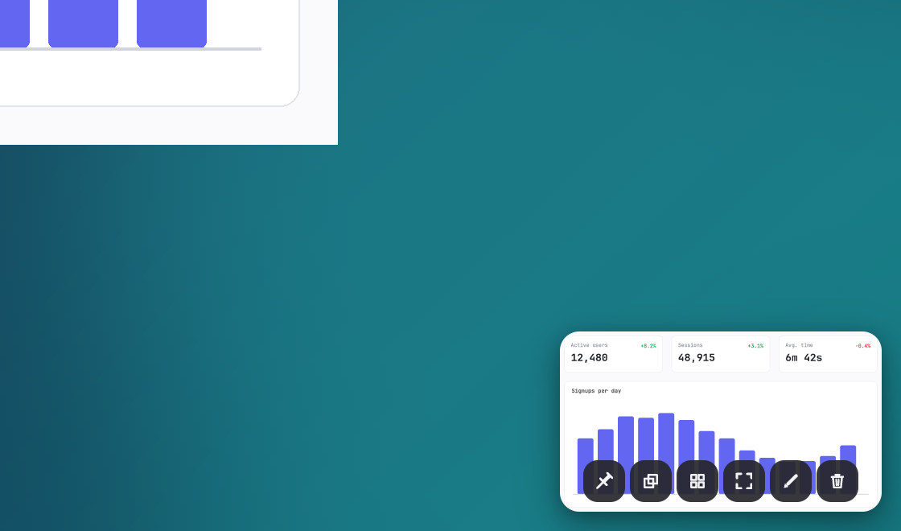

# Toast Notifications

After a capture commits, iris displays an interactive toast notification card in the configured corner of the display.

## Placement and Geometry

The toast lands in the display corner configured by `toast_position` in [configuration.md#toast](configuration.md#toast) (default: `bottom-right`; options: `bottom-right`, `bottom-left`, `top-right`, `top-left`):
- **Region capture**: Lands on the monitor containing the center coordinates of the captured region.
- **Fullscreen, window, and CLI invocations**: Lands on the primary monitor.

Dimensions and styling:
- The thumbnail scales aspect-true to fit within 200×140 logical pixels. Its pixels are box-filtered from the full capture to the card's size in device pixels: on a 2x display the card holds up to 400×280 pixels of the capture.
- Corner radius is 12.0 logical pixels.
- Edge margin is 12.0 logical pixels from display boundaries.
- Drop shadow applies a dual-layer box shadow: 12px blur at 8px Y offset and 5px blur at 2px Y offset.
- Entrance: Slides in from beyond the display edge over 380 milliseconds with quartic deceleration. When arriving from region capture flight, the card appears at rest without replaying the slide-in entrance.

## Interaction and Actions

### Left-Click

A single left click runs the action configured by `toast_click_action` in [configuration.md#toast](configuration.md#toast):
- `markup` (default): Opens the annotation editor over the capture (see [editor.md#annotation-editor](editor.md#annotation-editor)).
- `copy`: Copies raw image pixels to the system clipboard on a background thread and reports `"Copied image"` on the status band.
- `open-folder`: Reveals the saved file in the desktop file manager.
- `none`: Leaves the toast visible without action.

### File Drag-Out

When `toast_drag_enabled` is true in [configuration.md#toast](configuration.md#toast) (default: `true`), dragging the thumbnail initiates an operating system file drag of the saved PNG file:
- Begins when pointer movement exceeds 8.0 logical pixels without meeting the dismiss swipe direction threshold.
- **Linux X11**: Uses the XDnD protocol serving `text/uri-list`, with a rounded thumbnail under the cursor.
- **Windows**: Uses OLE drag-and-drop with the shell's data object for the file, the one Explorer drags: `CF_HDROP`, the shell ID list array, and file descriptors.
- **macOS**: Uses `NSDraggingSession` providing file `NSURL` items on the pasteboard.

### Swipe Dismiss

Dragging horizontally toward the adjacent display edge initiates a dismiss swipe:
- The card tracks the pointer 1:1.
- Dismissal triggers when horizontal travel exceeds 100.0 logical pixels, or release velocity exceeds 400.0 logical pixels per second. Velocity samples older than 120 milliseconds decay to zero.
- When dismissed, the card accelerates off the display edge over 300 milliseconds.
- Releasing below the thresholds returns the card to its resting position via a spring animation over 260 milliseconds.

### Auto-Dismiss Countdown

The card remains visible for `toast_duration_ms` (default: `5000` ms):
- Upon expiration, the card accelerates off the display edge over 300 milliseconds, fading during the final third.
- A subsequent capture replaces an existing toast with a 180-millisecond fade.
- Auto-dismiss timer behavior:
  - Hovering the pointer over the card pauses the countdown. Moving the pointer away resumes the timer.
  - Opening the context menu pauses the countdown.
  - An active OCR task holds the countdown open.
  - Pinning the toast card suspends auto-dismissal indefinitely.

## Toast Action Bar

When `toast_show_actions` is true in [configuration.md#toast](configuration.md#toast) (default: `true`), an action bar renders across the lower edge of the card.

The bar contains a centered row of 26×26 logical pixel icon buttons (3px gap, 6px bottom margin). The buttons do not display text tooltips.

Buttons render in the following order:
1. **Pin** (pin icon): Toggles the pinned state of the toast notification card, suspending auto-dismissal. Rendered only when `toast_pin_enabled` is true (default: `true`). Displays an active highlight fill while pinned.
2. **Copy image** (copy icon): Encodes and copies image pixels to the system clipboard on a background thread.
3. **Copy file** (grid icon): Copies the file path in platform file-list format (`text/uri-list`, `CF_HDROP`, or `NSURL`).
4. **Open folder** (viewfinder icon): Reveals the file in the desktop file manager.
5. **Annotate** (pen icon): Opens the image in the annotation editor.
6. **Delete** (trash icon): Deletes the PNG file from disk, deletes the cached thumbnail, removes the record from `library.json`, and dismisses the toast.

## Status Band

When an action produces feedback, the action bar is replaced by a status band across the lower edge of the card:
- Renders white text on a dark background at 86% opacity.
- Re-arms the auto-dismiss timer for `toast_duration_ms` so the message remains readable.
- Displays completion feedback (such as `"Copied image"` or `"Copied file"`) or error descriptions (such as `"Delete failed: <error>"`).

## OCR Text Extraction

Trigger OCR text extraction via the **Copy text (OCR)** item in the right-click context menu:
- Sets the status band to `"Reading text…"` and holds the auto-dismiss timer open.
- Executes `tesseract <source> stdout` as a background process.
- Requires Tesseract installed on the host system. Missing binary errors report platform installation instructions:
  - **Linux**: `tesseract is not installed: install the tesseract package (tesseract-ocr on Debian and Ubuntu)`
  - **macOS**: `tesseract is not installed: run `brew install tesseract``
  - **Windows**: `tesseract is not installed: run `winget install UB-Mannheim.TesseractOCR``
- If the image contains no recognized characters, reports `"no text recognized in this image"`.
- On completion, copies extracted text to the system clipboard as UTF-8 text and displays `"Copied <count> characters"` on the status band.

## Context Menu

Right-clicking the toast card opens a context menu that fades in over 120 milliseconds while rising 3 logical pixels.

Menu choices in order:
1. **Markup**: Opens the annotation editor over the capture.
2. **Copy**: Copies raw image pixels to the system clipboard.
3. **Copy text (OCR)**: Extracts text using Tesseract and copies it to the clipboard.
4. **Pin to screen**: Spawns an independent always-on-top reference window and dismisses the toast.
5. **Delete**: Deletes the PNG file, removes the cached thumbnail, deletes the library entry, and dismisses the toast.
6. **Close**: Dismisses the toast card immediately.

## Reveal in Folder

Platform implementations for folder reveal:
- **Linux**: Sends an `org.freedesktop.FileManager1.ShowItems` message via `dbus-send` (`--session --print-reply --reply-timeout=5000`) with the file URI. If D-Bus is unavailable or times out, falls back to `xdg-open` on the containing directory.
- **macOS**: Runs `/usr/bin/open -R <path>` to reveal and select the file in Finder. If the file is missing, runs `/usr/bin/open <dir>` on the parent directory.
- **Windows**: Calls `SHOpenFolderAndSelectItems` with a file item ID list (PIDL). If unresolved, runs `explorer.exe <dir>` on the parent directory.

## Pinned Windows

Triggered via the toast context menu (**Pin to screen**), the annotation editor, or the capture library (see [library.md#capture-library](library.md#capture-library)):
- Displays the capture in a borderless window with 8.0 logical pixel rounded corners and floating shadow.
- Scales the image aspect-true to fit within 720×540 logical pixels.
- Always-on-top status: On X11, assigns `_NET_WM_STATE_ABOVE` via a client message.
- Window movement: Click and drag anywhere on the image delegates movement to the window manager:
  - **Linux Wayland**: Calls `window.start_window_move()` (`xdg_toplevel.move`).
  - **Linux X11**: Tracks pointer coordinates and moves the window.
  - **Windows and macOS**: Invokes platform window drag routines.
- Closing gestures:
  - Double-click anywhere on the image.
  - Press `Escape`.

## Notices

A notice is a 380 logical pixel wide card in the toast corner of the primary display. It reports an outcome of a command whose trigger (a hotkey, the tray menu, the recording chip, or a forwarded command line) has already returned:
- A saved recording: a check mark, the title, the file name, and a folder button that reveals the file in the system file manager (see [Reveal in Folder](#reveal-in-folder) and [recording.md](recording.md#completion-and-failure-notices)).
- A failed command: an alert mark in red, the title, and the error on up to three lines, ending in an ellipsis when longer.

The **×** button at the card's right edge dismisses it.

Failure titles:

| Title | Command |
|---|---|
| `Capture failed` | Region, window, full-screen, or delayed capture |
| `Recording failed` | Starting, picking, or finishing a recording |
| `Pause failed` | `--record-pause` |
| `Microphone toggle failed` | `--record-mic` |
| `Copy failed` | Clipboard copy after a capture or an editor save |
| `Save failed` | Writing the edited image when the editor closes |
| `Pin failed` | Pinning a capture |
| `Home did not open`, `Library did not open`, `Settings did not open`, `Editor did not open`, `Toast did not open`, `Recording chip did not open` | Opening that window |
| `Quit failed` | `--quit` |

Timing and placement:
- The card slides in from beyond the screen edge and stays for `toast_duration_ms` (default: 5000 milliseconds). A failure stays for at least 8000 milliseconds.
- Hovering the pointer over the card pauses auto-dismissal. Moving the pointer off restarts the full duration.
- A newer notice replaces the card, and so does a toast that lands on it.
- A notice that would cover a toast resting in the same corner stacks beyond the toast card: above it in a bottom corner, below it in a top corner.
- The notice window never takes keyboard focus.
